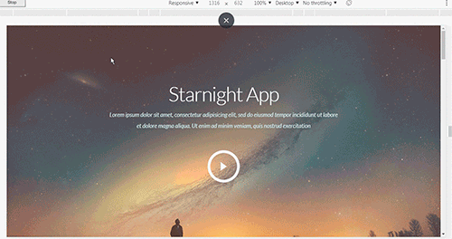

# Starnight

## Описание 

Адаптивная верстка под мобильные экраны, планшеты и десктопы. Работа с youtube api. Применена библиотека для анимации скроллинга animatedScroll.

        В связи с тем что данная страница является шаблонам. Некоторые ссылки могут не работать.
        
## Стек технологий примененный при разработке шаблона
*   ES5
*   jQuery
*   [slider slick](https://kenwheeler.github.io/slick/)
*   [animatedScroll](https://github.com/victor8titov/jquery.animateScroll)
##  Тесты    

Протестировано на следующих браузерах. Указаны версии где шаблон работает без ограничений.

### Desktop 
|   IE  |   Edge    |   Firefox |   Chrome  |  Safari   |   Opera   |   
|-------|-----------|-----------|-----------|-----------|-----------|  
| 11    |           |    45.0   |    46.0   |           |    57.0   |
|       |           |    65.0   |    72.0   |           |           |

    

### Mobile 
| IOS Safari | Opera Mobile | Android Browser | Chrome for Android | Firefox for android |
|------------|--------------|-----------------|--------------------|---------------------|
|            |     53.3     |                 |         72.0       |          65.0       |

##  Валидация    
Валидацию проходит но есть некоторые предупреждения.

## Tест скорости    
[https://developers.google.com/speed/](https://developers.google.com/speed/)

|  ***Для компьютеров***                    |***88%*** |        
|-------------------------------------------|----------|       
| Время загрузки первого контента           | 0,6 сек. |
| Индекс скорости загрузки                  | 1,7 сек. |
| Время загрузки для взаимодействия         | 2,3 сек. |
| Время загрузки достаточной части контента | 1,4 сек. |
| Время окончания работы ЦП                 | 2,2 сек. |
| Приблизительное время задержки при вводе  | 10 мс    |

|       ***Для мобильных***                 |***57%*** | 
|-------------------------------------------|----------|       
| Время загрузки первого контента           | 2,0 сек. |
| Индекс скорости загрузки                  | 4,4 сек. |
| Время загрузки для взаимодействия         | 10,5 сек.|
| Время загрузки достаточной части контента | 5,6 сек. |
| Время окончания работы ЦП                 | 5,6 сек. |
| Приблизительное время задержки при вводе  | 220 мс   |

##     Скриншоты шаблона

